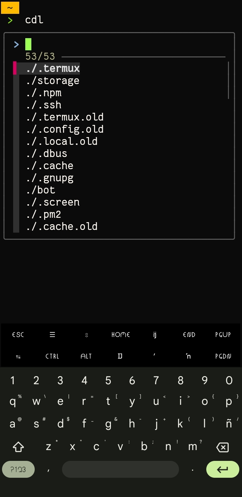
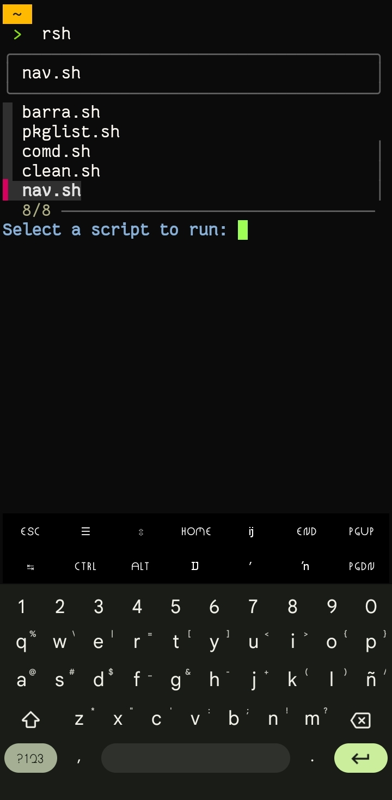
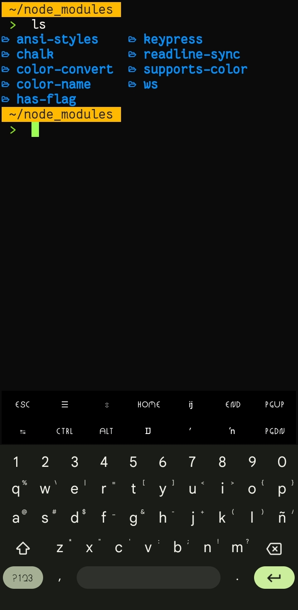
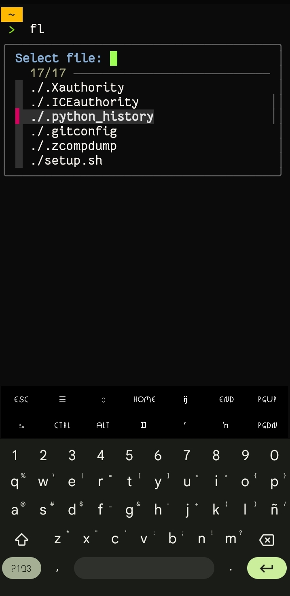

# BashUP

**BashUP** es una modificación del archivo `~/.bashrc`, en el cual se agregan comandos personalizados para mejorar tu experiencia en la terminal de **Termux**. Estos comandos están diseñados para facilitar la navegación y gestión de archivos y directorios, así como para optimizar el uso de herramientas comunes.

|||
|----------|----------|
|||


### Comandos personalizados incluidos:

1. **`cdl`** ➩ Lista los archivos del directorio actual.
2. **`fl`** ➩ Similar a `cdl`, pero enfocado en archivos. Al seleccionar un archivo, **Termux** intentará abrirlo con alguna aplicación del sistema.
3. **`rsh`** ➩ Muestra y permite ejecutar todos los scripts ubicados en la carpeta `~/myscript`.
4. **`sao`** ➩ Filtra y muestra los archivos por tipo (PDF, JPG, PNG, audio, etc.). Este comando es totalmente configurable.
5. **`ls`** ➩ Reemplaza el `ls` tradicional por `lsd`. Puedes instalarlo por separado si lo deseas: `pkg install lsd`.
6. **`fdl`** ➩ Busca archivos mayores a 50 MB y te ofrece la opción de eliminarlos.
7. **`szl`** ➩ Permite seleccionar un directorio para ver su tamaño total.

### Instalación

Para instalar **BashUP**, sigue estos pasos:

1. Clona el repositorio:

    ```
    git clone https://github.com/Jmahyals/bashUP
    ```
3. Navega al directorio del proyecto:

    ```
    cd bashUP
    ```
4. Ejecuta el script de instalación:

    ```
    bash setup.sh
    ```
5. Mueve el bash personalizado:
 
   ```
   mv .bashrc ~/
   ```
   
7. Aplica los cambios recargando el archivo 

    ```
    source ~/.bashrc
    ```

### Requisitos

Este proyecto utiliza `lsd` y `fzf`, puedes instalarlos por tú cuenta, por si lo quieres usar sin necesidad del `~/bashrc` modificado.

### Notas

Disfruta de una terminal más eficiente con **BashUP**. Si encuentras algún problema o tienes sugerencias, no dudes en abrir un issue en el repositorio.
